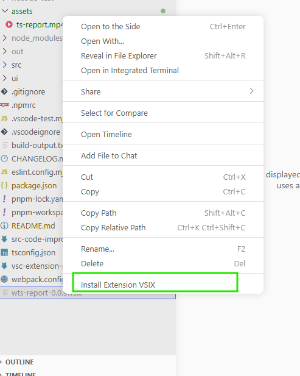

# WTS Report — VS Code Extension

WTS Report is a VS Code extension that automatically detects your git changes and generates AI-powered timesheet reports. Collect work items, track hours, and submit reports directly from VS Code.

## Features

- **Automatic Git Detection** — Scans your working directory for uncommitted changes
- **AI-Powered Summaries** — Uses LLM to generate work summaries and descriptions
- **Timesheet Tracking** — Add work items with hours worked and model information
- **Easy Report Generation** — Submit formatted timesheet reports from the webview
- **VS Code Integration** — Access directly from the command palette

## Demo

Watch a quick demo of WTS Report in action:

<video width="100%" controls>
  <source src="./assets/ts-report.mp4" type="video/mp4">
  Your browser does not support the video tag.
</video>

---

## 👤 Using WTS Report (End Users)

### Installation

1. Clone this repository:
   ```powershell
   git clone <repo-url>
   cd wts-report
   ```

2. Locate the VSIX file: `wts-report-0.0.9.vsix`

3. Right-click the file and select **"Install Extension"** (or use the command below):
   ```powershell
   code --install-extension wts-report-0.0.9.vsix
   ```

   

### Quick Start

1. Open the Command Palette (`Ctrl+Shift+P`)
2. Run **WTS Report** command
3. The webview opens with your git changes detected
4. Add work items or let AI generate summaries
5. Select your model and hours worked
6. Submit your timesheet report

---

## 👨‍💻 Development (For Contributors)

### Prerequisites

- **Node.js** >= 20
- **pnpm** >= 9 ([install](https://pnpm.io/installation))

```powershell
# Verify
node --version
pnpm --version
```

## Quick setup

Install dependencies for both the extension and the UI **in a single command**:

```powershell
pnpm install
cd ui && pnpm install && cd ..
```

> The root `.npmrc` uses `shamefully-hoist=true` so the VS Code extension host can resolve runtime dependencies like `mocha` and `glob`.

## Run the extension in VS Code (development)

1. **Build the UI** and compile the extension:

```powershell
pnpm run compile
```

This runs `tsc` + copies the UI bundle into `out/`.

2. **Launch the Extension Development Host**:

   - Open the project in VS Code and press `F5`.
   - In the new window, open the Command Palette (`Ctrl+Shift+P`) and run **WTS Report** (or `extension.startExtension`).

3. **Iterate**:

   - Extension code: edit `.ts` files → re-run `pnpm run compile` → reload in the dev host.
   - UI code: edit files in `ui/src/` → rebuild with `cd ui && pnpm run build` → re-run `pnpm run compile`.

## Run the UI standalone (browser)

The UI is a React app powered by webpack-dev-server. Useful for rapid UI iteration without reloading the extension host.

```powershell
cd ui
pnpm install
pnpm start:dev
```

This opens `http://localhost:8080` with Hot Module Replacement. Note that VS Code APIs (`acquireVsCodeApi`) are **not available** in the browser — some features will be stubbed.

### Generate the VSIX installer

Package the extension into a `.vsix` file for installation into your normal VS Code:

```powershell
pnpm vsce package
```

This runs the `vscode:prepublish` script (compile + UI build) and produces `wts-report-<version>.vsix`.

To install directly:

```powershell
code --install-extension wts-report-0.0.9.vsix
```

> **Note**: The VSIX excludes `node_modules/`, `.atl/`, `pnpm-lock.yaml`, and `pnpm-workspace.yaml` via `.vscodeignore`.
> License file is not bundled — a warning appears during packaging but is safe to ignore for local use.

### Troubleshooting

- **Webview blank**: confirm `out/index.html` and `out/main.js` exist (created by `pnpm run compile`).
- **`Cannot find module 'mocha'`**: run `pnpm install` from the root — `mocha` and `glob` are direct devDependencies hoisted to root by `shamefully-hoist=true`.
- **Debug the webview**: with the webview focused, run **Help → Toggle Developer Tools** to inspect console/network errors.
- **pnpm build scripts blocked**: if you see `ERR_PNPM_IGNORED_BUILDS`, run `pnpm approve-builds @vscode/vsce-sign keytar`.
- **Update UI only**: `cd ui && pnpm run build && cd .. && pnpm run compile`.

### Useful commands

| Action | Command |
|--------|---------|
| Install all deps | `pnpm install && cd ui && pnpm install` |
| Build UI | `cd ui && pnpm run build` |
| UI dev server (browser) | `cd ui && pnpm start:dev` |
| Compile extension | `pnpm run compile` |
| Run tests | `pnpm test` |
| Package VSIX | `pnpm vsce package` |
| Install VSIX locally | `code --install-extension wts-report-*.vsix` |

### Package manager

This project uses **pnpm** with the following configuration:

- `shamefully-hoist=true` — hoists direct dependencies to root for VS Code extension host compatibility
- `confirm-modules-purge=false` — prevents interactive prompts in CI
- `pnpm-workspace.yaml` — tracks approved build scripts (`@vscode/vsce-sign`, `keytar`)

---

Thank you for using WTS Report.
